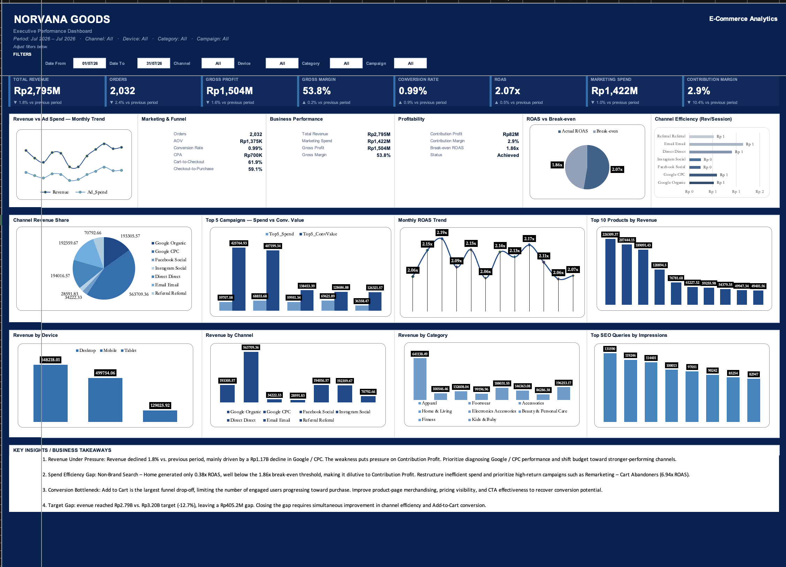

# Norvana Goods — E-Commerce Growth & Marketing Analytics

[](#)
[](#)
[](#)
[](#)

**An end-to-end e-commerce analytics portfolio project** analyzing August 2025 – July 2026 performance across revenue, marketing efficiency, customer funnel conversion, SEO opportunities, product performance, and profitability.

<p align="center">
  <a href="dashboard/Norvana_Goods_Executive_Dashboard.xlsx">
    
  </a>
</p>

---

## Project Overview

**Norvana Goods** is a fictional Direct-to-Consumer (D2C) e-commerce brand created as a Data Analyst portfolio case study.

The brand sells apparel, footwear, accessories, home goods, electronics, beauty, fitness, and kids' products through its own online store.

This project analyzes performance from **August 2025 to July 2026** across:

- Sales and revenue performance
- Marketing channels and campaigns
- Customer conversion funnel
- SEO performance
- Product and category economics
- Gross and contribution profitability

The project was designed around a central business question:

> **Where is performance being lost, what is driving the gap, and where should the business prioritize its next actions?**

Rather than focusing only on reporting KPIs, the analysis connects business performance with its underlying drivers and translates findings into actionable decisions.

---

## Business Questions

The analysis is structured around five core business questions:

| Area | Business Question |
|---|---|
| **Growth** | Which channels and campaigns are driving profitable revenue? |
| **Conversion** | Where is the largest funnel drop-off, and how can it be improved? |
| **SEO** | Which search opportunities remain untapped? |
| **Profitability** | Which products and categories generate sustainable economic value? |
| **Target** | Is the business on track to meet its revenue target, and where should the next budget be allocated? |

---

## Executive Dashboard

The final deliverable is a **single Executive Dashboard** designed to provide a consolidated view of commercial performance and its underlying drivers.

The dashboard brings together:

- Revenue and target performance
- Marketing spend and ROAS
- Gross Profit and Contribution Profit
- Funnel conversion
- SEO opportunities
- Product performance
- Profitability
- Key findings
- Recommended actions

The dashboard is structured around three management questions:

**What happened? → Why did it happen? → What should we do next?**

### Dashboard Preview



<p align="center">
  <a href="dashboard/Norvana_Goods_Executive_Dashboard.xlsx">
    
  </a>
</p>

---

## Key Insights

### Revenue Performance

Revenue reached approximately **Rp2.79B**, representing a **1.8% decline versus the previous period** and a **12.7% gap against the Rp3.2B target**.

The decline was primarily associated with weaker **Google / CPC** performance.

**Business implication:** The revenue gap should be addressed through channel-level diagnosis and more disciplined budget allocation rather than simply increasing total acquisition spend.

---

### Marketing Efficiency

Overall ROAS stood at **2.07x**, compared with an estimated **1.86x break-even ROAS**.

Two campaigns illustrate the largest efficiency gap:

| Campaign | ROAS | Signal |
|---|---:|---|
| Remarketing – Cart Abandoners | **6.94x** | Scale Candidate |
| Non-Brand Search – Home | **0.38x** | Below Break-even |

**Business implication:** Inefficient campaigns should be reduced or restructured, while higher-return campaigns should be protected and evaluated for additional investment.

---

### Funnel Performance

The largest funnel bottleneck occurred between **Engaged Sessions and Add to Cart**, with a **95.4% drop-off**.

**Business implication:** The key constraint is not only customer acquisition. Improving product-page merchandising, pricing visibility, product information, and CTA effectiveness may provide a stronger path to incremental conversion.

---

### SEO Opportunity

The analysis identified:

- **5 high-impression / low-CTR queries** representing opportunities to improve search-result visibility.
- **13 queries ranking well but generating zero conversions**, suggesting potential landing-page or search-intent alignment issues.

**Business implication:** SEO optimization should focus not only on rankings, but also on converting existing search visibility into qualified traffic and revenue.

---

### Product Profitability

**Electronics Accessories** generated the highest category revenue at approximately **Rp362.7M**.

The product analysis identified **12 of 31 products** within the **High Revenue / High Margin** quadrant.

**Business implication:** High-revenue and high-margin products represent stronger candidates for protection, promotion, and further commercial investment.

---

## Analytical Framework

The project follows a connected analytical framework:

```text
SALES
  ↓
MARKETING
  ↓
FUNNEL
  ↓
SEO
  ↓
PRODUCT
  ↓
PROFITABILITY
  ↓
EXECUTIVE DECISION
```

Each layer answers a different business question:

| Layer | Analytical Focus |
| ----- | ----------------- |
| **Sales** | What happened to revenue and target performance? |
| **Marketing** | Which channels and campaigns are driving or diluting growth? |
| **Funnel** | Where are customers being lost before conversion? |
| **SEO** | Where are the untapped organic growth opportunities? |
| **Product** | Which categories and products are driving commercial performance? |
| **Profitability** | Which revenue streams create sustainable economic value? |

The framework moves the analysis from:

> **Performance → Driver → Diagnosis → Action**

---

## Analytical Approach

The workbook follows an end-to-end analytical workflow:

```text
RAW DATA
    ↓
DATA QA
    ↓
CALCULATION ENGINE
    ↓
ANALYTICAL METRICS
    ↓
EXECUTIVE DASHBOARD
    ↓
BUSINESS DECISIONS
```

### 1. Data Layer

The analysis uses five synthetic source datasets:

- GA4 data
- Google Ads data
- SEO / Search Console-style data
- E-commerce transaction data
- Product master data

### 2. Data Quality Layer

The `DATA_QA` sheet contains automated data-integrity and cross-source checks using:

**PASS / CHECK / FAIL**

This layer validates data quality and reconciliation before metrics reach the dashboard.

### 3. Calculation Layer

The `CALCULATIONS` sheet acts as the central formula engine for the workbook.

Key metrics include:

- Revenue
- Orders
- AOV
- Marketing Spend
- ROAS
- Break-even ROAS
- Gross Profit
- Gross Margin
- Contribution Profit
- Contribution Margin
- Conversion Rate
- CPA
- CPC
- Target and Variance

### 4. Analytical Layer

Detailed metric tables support:

- Channel performance
- Campaign efficiency
- SEO query analysis
- Product profitability
- Monthly performance trends

### 5. Decision Layer

The final dashboard translates analytical findings into business actions around:

- Budget allocation
- Campaign optimization
- Funnel improvement
- SEO opportunities
- Product prioritization
- Profitability protection

---

## Business Recommendations

Based on the analysis, the main priorities are:

1. **Reduce or restructure below-break-even campaigns**, particularly Non-Brand Search – Home.
2. **Protect and scale high-return campaigns**, including Remarketing – Cart Abandoners.
3. **Address the Add-to-Cart bottleneck** through product-page and merchandising improvements.
4. **Improve high-impression / low-CTR SEO queries** to convert existing search visibility into qualified traffic.
5. **Review high-ranking but non-converting queries** for landing-page and search-intent alignment.
6. **Prioritize high-revenue / high-margin products** when allocating promotional and marketing resources.
7. **Close the revenue target gap through efficiency and conversion improvements**, rather than relying solely on additional acquisition spend.

---

## Workbook Structure

```text
Norvana_Goods_Executive_Dashboard.xlsx
│
├── DASHBOARD
├── DATA_QA
├── CALCULATIONS
│
├── Channel_Metrics
├── Campaign_Metrics
├── SEO_Query_Metrics
├── Product_Metrics
├── Monthly_Trend
│
├── GA4_DATA
├── GOOGLE_ADS_DATA
├── SEO_DATA
├── ECOMMERCE_DATA
└── PRODUCT_MASTER
```

| Sheet / Layer | Purpose |
| -------------- | ------- |
| `DASHBOARD` | Single Executive Dashboard |
| `DATA_QA` | Data quality and cross-source reconciliation |
| `CALCULATIONS` | Central formula engine |
| `Channel_Metrics` | Channel-level performance |
| `Campaign_Metrics` | Campaign-level efficiency |
| `SEO_Query_Metrics` | SEO opportunity analysis |
| `Product_Metrics` | Product and profitability analysis |
| `Monthly_Trend` | Monthly performance history |
| Raw Data | Controlled source datasets |

---

## Tools & Skills

### Tools

[](#)

### Excel & Analytical Techniques

- `SUMIFS`
- `XLOOKUP`
- Conditional logic
- KPI calculations
- Period-over-period analysis
- Target and variance analysis
- Cross-source reconciliation
- Ranking and segmentation
- Dashboard visualization
- Business analysis

### Analytical Skills

- Business problem framing
- Data quality validation
- Marketing performance analysis
- Funnel analysis
- SEO opportunity analysis
- Product profitability analysis
- Performance diagnosis
- Business recommendation
- Budget allocation analysis

---

## Data & Methodology

All data in this project is **synthetic** and created specifically for portfolio purposes.

Norvana Goods is a fictional company.

The dataset is intentionally designed to simulate realistic e-commerce reporting conditions, including measurement differences and reconciliation gaps between commercial, analytics, advertising, and SEO data sources.

**E-commerce transaction data** is treated as the commercial source of truth for revenue and profitability, while **GA4** is primarily used for behavioral and funnel analysis.

SEO data is maintained as an independent **Search Console-style dataset** and is not expected to reconcile exactly with GA4 Organic data due to differences in measurement methodology and attribution.

All monetary values are presented in **Indonesian Rupiah (IDR)**.

---

## Project Files

| File | Description |
| ---- | ----------- |
| [Norvana Goods Executive Dashboard](dashboard/Norvana_Goods_Executive_Dashboard.xlsx) | Complete interactive Excel workbook |
| [Executive Dashboard Preview](screenshots/executive-dashboard.png) | Dashboard screenshot |

<p align="center">
  <a href="dashboard/Norvana_Goods_Executive_Dashboard.xlsx">
    
  </a>
</p>

---

## Why This Project

This project was designed to demonstrate an analytical process that goes beyond dashboard creation.

The focus is on connecting:

**Business Question → Data → QA → Calculation → Analysis → Insight → Recommendation**

The final deliverable is not simply a collection of charts, but a **decision-oriented analytical system** designed to help management understand performance, identify its drivers, and prioritize actions.

---

## Author

**Nabilla Salsa**

Data Analyst | Business & Marketing Analytics

[LinkedIn](https://www.linkedin.com/in/nabillasalsa/)

---

## Disclaimer

Norvana Goods is a fictional brand created for portfolio purposes.

All data, figures, business scenarios, and findings are synthetic and do not represent a real company.

---

**Thank you for taking the time to explore this project.**
